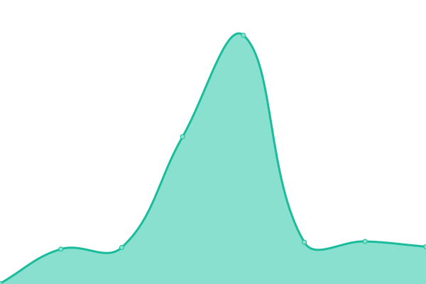

# [📈 Live Status](https://herbafill-hfg.github.io/status/): <!--live status--> **🟩 All systems operational**

This repository contains the open-source uptime monitor and status page for [Herbafill-HFG](https://herbafill-hfg.github.io/status/), powered by [Upptime](https://github.com/upptime/upptime).

With [Upptime](https://upptime.js.org), you can get your own unlimited and free uptime monitor and status page, powered entirely by a GitHub repository. We use [Issues](https://github.com/Herbafill-HFG/status/issues) as incident reports, [Actions](https://github.com/Herbafill-HFG/status/actions) as uptime monitors, and [Pages](https://herbafill-hfg.github.io/status/) for the status page.

<!--start: status pages-->
<!-- This summary is generated by Upptime (https://github.com/upptime/upptime) -->
<!-- Do not edit this manually, your changes will be overwritten -->
<!-- prettier-ignore -->
| URL | Status | History | Response Time | Uptime |
| --- | ------ | ------- | ------------- | ------ |
|  [YouTube](https://youtube.com) | 🟩 Up | [you-tube.yml](https://github.com/Herbafill-HFG/status/commits/HEAD/history/you-tube.yml) | 

 368ms
     
 | 

<a href="https://Herbafill-HFG.github.io/status/history/you-tube">100.00%</a>
    

|  [Orrdugi](https://orrdugulasellen.hu) | 🟩 Up | [orrdugi.yml](https://github.com/Herbafill-HFG/status/commits/HEAD/history/orrdugi.yml) | 

 850ms
     
 | 

<a href="https://Herbafill-HFG.github.io/status/history/orrdugi">100.00%</a>
    

|  [Herbafill](https://herbafill.hu) | 🟩 Up | [herbafill.yml](https://github.com/Herbafill-HFG/status/commits/HEAD/history/herbafill.yml) | 

 726ms
     
 | 

<a href="https://Herbafill-HFG.github.io/status/history/herbafill">100.00%</a>
    

|  [Reflux - Hu](https://refluxparna.hu) | 🟩 Up | [reflux-hu.yml](https://github.com/Herbafill-HFG/status/commits/HEAD/history/reflux-hu.yml) | 

 748ms
     
 | 

<a href="https://Herbafill-HFG.github.io/status/history/reflux-hu">100.00%</a>
    

|  [Gegen](https://gegenverstopftenase.de) | 🟩 Up | [gegen.yml](https://github.com/Herbafill-HFG/status/commits/HEAD/history/gegen.yml) | 

 900ms
     
 | 

<a href="https://Herbafill-HFG.github.io/status/history/gegen">100.00%</a>
    

|  [Reflux - De](https://refluxkissen.de) | 🟩 Up | [reflux-de.yml](https://github.com/Herbafill-HFG/status/commits/HEAD/history/reflux-de.yml) | 

 769ms
     
 | 

<a href="https://Herbafill-HFG.github.io/status/history/reflux-de">100.00%</a>
    

|  [Beistress - De](https://beistress.de) | 🟩 Up | [beistress-de.yml](https://github.com/Herbafill-HFG/status/commits/HEAD/history/beistress-de.yml) | 

 1728ms
     
 | 

<a href="https://Herbafill-HFG.github.io/status/history/beistress-de">100.00%</a>
    

|  [Oreiller - Fr](https://oreillerreflux.fr) | 🟩 Up | [oreiller-fr.yml](https://github.com/Herbafill-HFG/status/commits/HEAD/history/oreiller-fr.yml) | 

 736ms
     
 | 

<a href="https://Herbafill-HFG.github.io/status/history/oreiller-fr">100.00%</a>
    

|  [Impex.Eu](https://impex-erp.herbafill.services) | 🟩 Up | [impex-eu.yml](https://github.com/Herbafill-HFG/status/commits/HEAD/history/impex-eu.yml) | 

 601ms
     
 | 

<a href="https://Herbafill-HFG.github.io/status/history/impex-eu">100.00%</a>
    

|  [HfgCorp](https://herbafill.group) | 🟩 Up | [hfg-corp.yml](https://github.com/Herbafill-HFG/status/commits/HEAD/history/hfg-corp.yml) | 

 106ms
     
 | 

<a href="https://Herbafill-HFG.github.io/status/history/hfg-corp">100.00%</a>
    

|  [Rflln-LP](https://refluxellen.hu) | 🟩 Up | [rflln-lp.yml](https://github.com/Herbafill-HFG/status/commits/HEAD/history/rflln-lp.yml) | 

 608ms
     
 | 

<a href="https://Herbafill-HFG.github.io/status/history/rflln-lp">100.00%</a>
    

<!--end: status pages-->

[**Visit our status website →**](https://herbafill-hfg.github.io/status/)

## 📄 License

- Powered by: [Upptime](https://github.com/upptime/upptime)
- Code: [MIT](./LICENSE) © [Herbafill-HFG](https://herbafill-hfg.github.io/status/)
- Data in the `./history` directory: [Open Database License](https://opendatacommons.org/licenses/odbl/1-0/)
